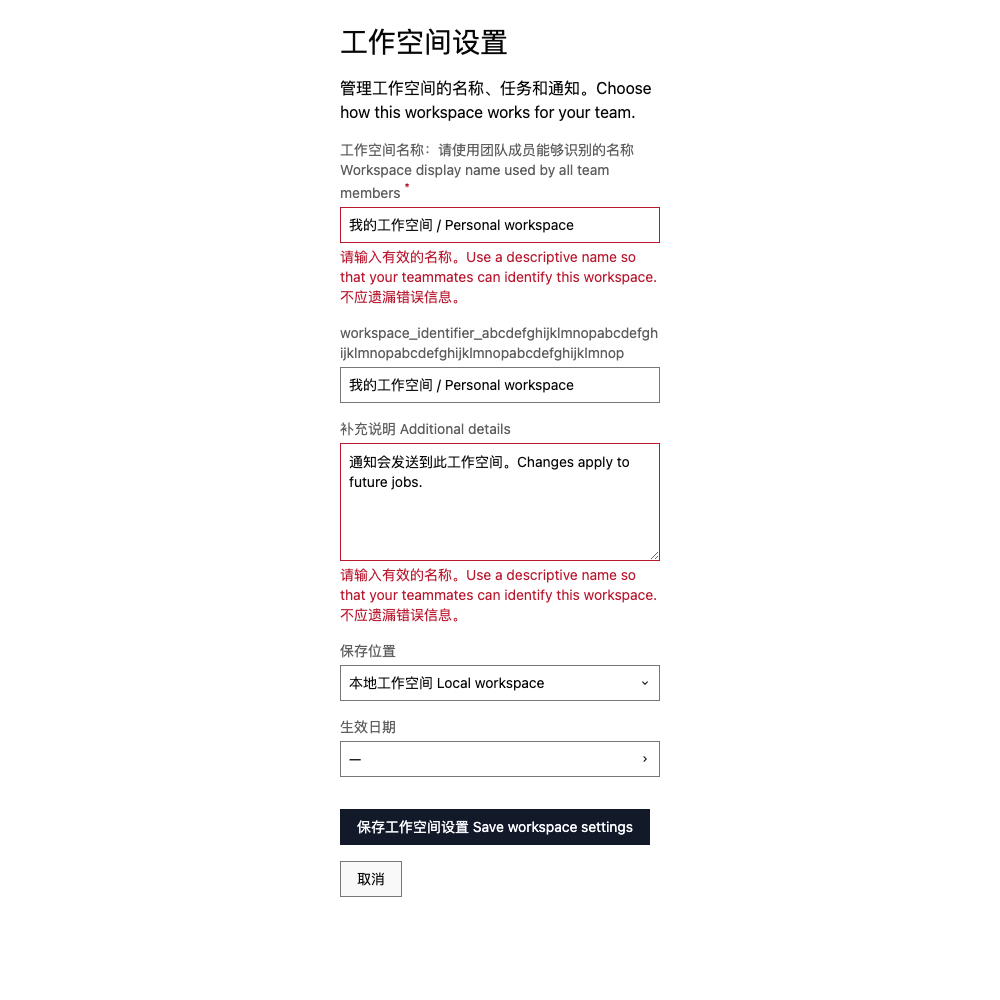
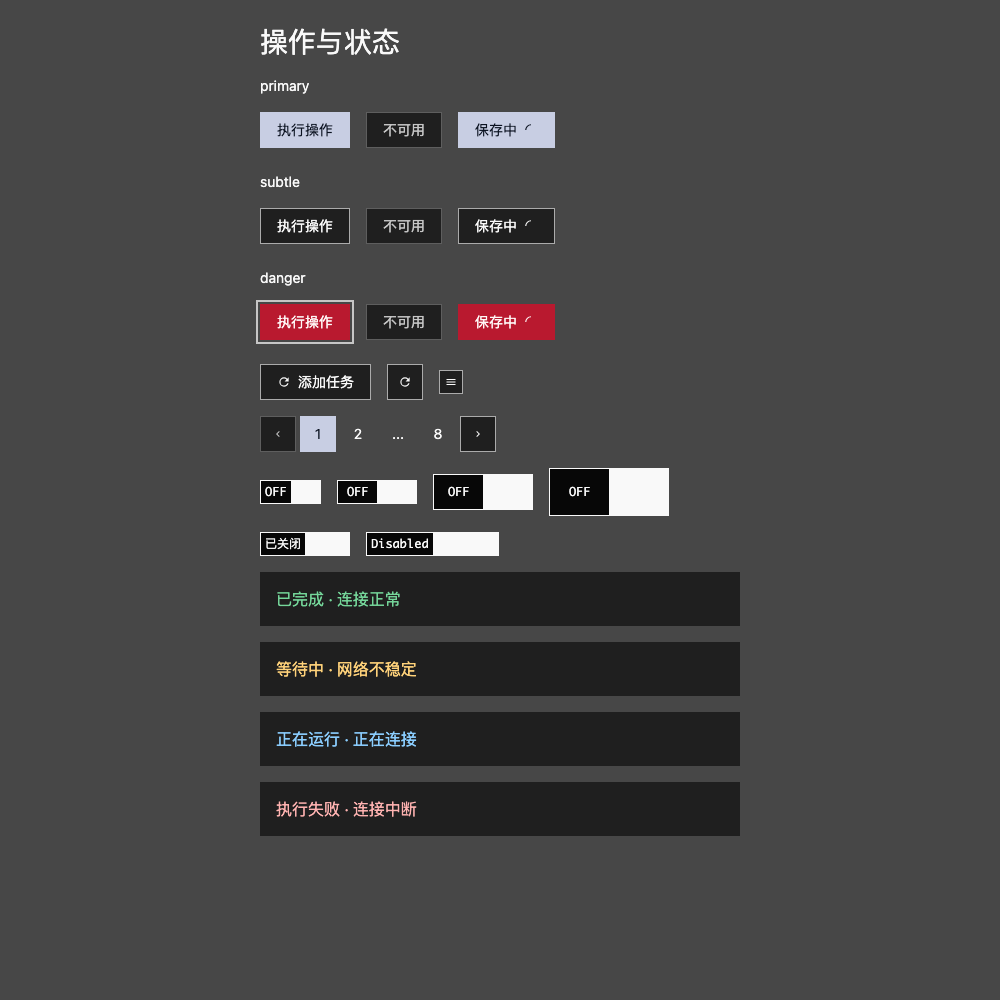

# 判断依据

比较设计方案时，要同时看内容、容器和状态。下面的例子分别说明字段关联、动作区别和内容增长时需要保持的关系。

## 从例子提取什么

先看例子面对的内容、容器和状态，再确认它保留了哪些关系，以及另一种选择会改变什么。复用有理由的关系；不要把一个截图中的全部数值、措辞和偶然布局当成规范。

| 方案面对的情况                       | 判断重点                                               | 可接受的变化                                                 |
| ------------------------------------ | ------------------------------------------------------ | ------------------------------------------------------------ |
| 同一设置区块被拆成许多卡片           | 外框是否提供了新含义，还是打断字段与说明的关联         | 改用标题、对齐与区块间距；确有独立对象时保留容器             |
| 每个区域都使用强调色或同样醒目的标题 | 用户能否区分主要内容、状态和操作                       | 降低辅助信息的强调，保留必要状态和焦点                       |
| 从宽页面进入窄侧栏                   | 阅读顺序、对象归属和动作是否仍然完整                   | 换行、改变列数、局部滚动，不以缩字或截断必要内容换取外框不变 |
| 多种状态与层级的信息挤在同一页面     | 当前任务是否用得上每项内容，减少后是否仍能顺利完成任务 | 删除重复信息；次要详情按需进入，当前错误与必要操作直接呈现   |
| 新组件没有现成样板                   | 能否从设计立场解释其表达，并与相邻组件共同成立         | 有依据的局部变化；新增共享角色须有共同用途                   |

这些是比较方案的判断方向，不是自动评分表。即便两种方案都可读、都使用合法 Token，仍需比较它们呈现的信息秩序与视觉性格。

## 长字段与错误说明

在 320px 宽的表单内容区域中，长标签和错误说明换行，字段随内容增长。每条说明紧邻对应字段，红色前景表达错误，标题、正文与标签保留各自的阅读职责。若为维持固定字段高度而裁切文字，用户就可能失去修正输入所需的信息。

这个例子展示字段内部的关联。截图外侧留白不参与表单布局；实际页面的外部空间与字段密度按容器和内容安排。

## 操作与状态的区别

主要动作、辅助动作和危险动作有不同表达；pending 保留动作文字，普通 disabled 有自己的弱化表现。反馈文字在普通表面上表达不同状态，文字说明使含义不只依赖颜色。

图中并列展示不同的动作和状态，便于比较。实际页面按当前任务确定主要动作；若多个动作同时获得最强强调，用户会难以辨认下一步。

## 信息按任务出现

来源列表先显示辨认和比较所需的名称与状态，完整配置放在详情中编辑。若同一个同步状态已经清楚表达，重复的图标、文字标签和解释不会增加信息，可以移除。连接失败时，错误原因与恢复入口进入当前视图；保存配置时，用户的修改和保存结果留在编辑上下文中。

在窄容器中，可以把次要操作收进有名称的入口，但主要任务不应因此需要反复展开。进入详情再返回时保持原来的位置与选择，已打开的正文继续完整阅读。这样减少的是当前视图的负担，而不是任务所需的信息与能力。

## 中西文排印

中文与西文混排时，保留西文单词内部的自然字距，在汉字与西文字母、数字的交界处安排适量间距；中文标点附近不机械地补空格。标点形式与断行方式需结合文本语言及地区习惯，核对行首、行尾和不可拆开的符号组合。相关规则见 [W3C《中文排版需求》草案](https://www.w3.org/TR/clreq/)。

正文的字体、字号、行距与行长应一起判断，参见 [Butterick 的正文排印指南](https://practicaltypography.com/body-text.html)。其[行长建议](https://practicaltypography.com/line-length.html)针对西文，不直接换算成中文统一字数或所有界面的固定宽度。用实际中英文段落核对换行、回行和段落节奏，短标签与连续正文分别判断。

排印调整作用于显示层。用户原文、代码、URL 和标识符保持原始内容；不能为了字距或断行方便而统一改写文本。Web 的字体、样式与覆盖入口从 [README](../../README.md) 继续查阅。

## 比较完整页面

将两个方案放在相同的内容、容器和交互状态下，沿同一任务阅读和操作。内容阅读关注正文是否连续、元数据是否干扰；对象管理关注条目是否容易比较、操作归属是否清楚；配置修改关注字段关联、提交与反馈是否完整。

调整文字、颜色或边界后，说明用户更容易辨认了什么，以及哪些信息受到弱化。再用长内容和窄容器核对这些关系是否仍然成立。局部控件的表达见[视觉语言](visual-language.md)，信息和操作的组织见[页面组合](composition.md)。
