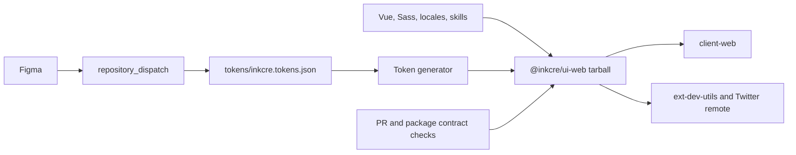

# UI Engineering And Design-to-UI Migration

- **Objective**: establish a reproducible, agent-friendly engineering and development contract for the InKCre UI library, then migrate the repository and published package identity from `design` to `ui` without carrying existing package-contract defects into the new identity. Complete the registry-backed consumer migration and remote identity closure against the already-published artifact before making the web package a first-class Oxc/native-TypeScript development unit and replacing its nominal Agent Skill delivery with an installed-package TanStack Intent contract.
- **Guardrails**: preserve current product behavior, Vue component APIs (`Ink*`), CSS classes (`.ink-*`), and token contracts (`--ref-*`, `--sys-*`, `--comp-*`) unless a separate breaking-change decision is explicitly approved; retain accurate domain terms such as “Design System” and “design tokens” instead of mechanically replacing every `design` string; keep `tokens/inkcre.tokens.json` authoritative and generated Sass, UnoCSS, component facts, and Agent Skill references derived; keep reviewed intent/composition guidance explicit rather than inferring product judgment from source syntax; treat the published tarball rather than a source alias as the consumer contract; preserve the frozen-install contract in `../client-web`; keep repository, package, consumer, and remote-governance changes in bounded slices; do not implement, commit, publish, rename a remote repository, or mutate `../client-web` until Sir explicitly starts the relevant slice.
- **Verification**: prove one pinned runtime and one lockfile can reproduce installation; provide one green root check covering package-local formatting/linting, one workspace TypeScript host, Vue type/declaration checking, tests, build, generator consistency, Intent validation/load, and package-contract smoke tests; verify the packed target web package through its JavaScript, types, CSS, Sass, token, locales, utilities, UnoCSS, and installed skill surfaces; run the complete `../client-web` check and affected extension builds against the published package; confirm generated artifacts are deterministic; confirm release and token-update workflows produce the required changeset and package through a deterministic workflow fixture; verify active code, configuration, and consumer documentation no longer depend on the old identity except for an explicitly approved historical or compatibility surface; verify GitHub Packages and remote URLs after the repository rename, with a live Figma dispatch retained as a post-deployment smoke rather than the only gate.
- **Current Truth**: Executions 01–05 and the producer packet are committed in `b1e0d6a`, `322dcf6`, `5d05693`, and `1d4ab92`; Execution 06 is committed and pushed in `../client-web` as `b08cade`. The GitHub repository is `InKCre/ui`, the local remote and private package association follow it, and remote identity fixes are committed through `59ec82f`. Release PR #31 is open and clean with both the reproducible workspace and Cloudflare checks passing; it has not yet been merged or published. Executions 08A and 08B plus their minor Changeset are complete: `packages/web` has package-local Oxc workflows, the exact TypeScript native bridge is canonical, a valid full declaration tree replaces the incompatible bridge/API-Extractor rollup, and one deterministic `@inkcre/ui-web#ui-web` Intent skill replaces `agent-skills/`. Both the working checkout and a disposable frozen-install copy pass the complete root check. Sir authorized the bounded commit and PR #31 merge; Ubuntu CI, the refreshed exact registry version, and its installed-skill probe are the remaining release gates. Live Figma integration remains an external handoff.
- **Next Step**: land the bounded 08A/08B commit, prove Ubuntu glibc CI, confirm the release PR refresh, then merge PR #31 and verify the exact published package through an installed-skill consumer probe. The local checkout directory rename remains deferred to a session boundary.

## Classification And Active Posture

- Constraint: engineering, package, registry, workspace, CI, and cross-repository development boundaries must change while product behavior remains stable.
- Reality: the producer package, first registry artifact, source association, known-consumer Actions read boundary, and local registry-backed consumer graph are green. The migration artifact is frozen at `@inkcre/ui-web@1.2.2`; newly requested Oxc/native-TypeScript and installed Agent Skill contracts follow remote identity closure rather than redefining it.
- Artifact: this packet, the phased migration plan, package-contract fixture, story-coverage gate, web-DX and Intent task files, migration guide, and execution evidence.
- Active posture: Harden. The migration and known-consumer graph are proven;
  the producer-DX and installed-skill baseline awaits remote CI and normal
  release closure.

## Evidence Snapshot

- `package.json` now carries the private `@inkcre/ui` workspace identity and exposes the pinned toolchain and canonical root development/check commands.
- `packages/web/package.json` names `@inkcre/ui-web@1.2.2`, publishes to GitHub Packages with restricted access, and exposes only built JavaScript, declarations, CSS, Sass, token, locale, utility, UnoCSS, migration, and `skills/` surfaces.
- `scripts/lib/ui-package.ts` resolves the renamed package once; token, package-metadata, and Intent skill generators derive their outputs from repository and manifest authority instead of caller cwd.
- `.github/workflows/ci.yml` runs the root frozen-install contract, generated-output gates, story coverage, tests, build, packed contract, and Histoire smoke with read-only contents permission. The token-update workflow validates input and creates a deterministic package changeset.
- `.npmrc` contains only the `@inkcre` registry route. Local credentials belong to trusted user configuration, and CI publication credentials exist only on the release step.
- The root does not claim publication metadata. `@inkcre/ui-web` owns its `InKCre/ui` repository link, package directory, restricted access policy, and GitHub Packages registry; GitHub links the private package to `InKCre/ui`.
- The package manifest lists 21 public components; a mechanical gate proves exactly 21 stories, 21 story documents, and 108 variants across six user-facing categories.
- The revised suite passes 104 behavior-focused tests in 12 files. Ten public components without focused tests remain a visible behavior-test backlog.
- Declaration diagnostics fail the build. The bridge-backed full declaration tree normalizes Vue declaration names inside `dist`; the packed contract resolves every relative type import, rejects undeclared external type packages, and contains no workspace/private source-path leaks.
- Package metadata, tokens, and the 27-file Intent skill regenerate repeatably. Two skill passes have aggregate SHA-1 `e440b025445006c64e151b0c0f5adf51de3d24c7`, and seed/story stale fixtures fail as intended.
- Oxlint `1.75.0` and Oxfmt `0.60.0` are pinned at the root and exposed through focused package-local web commands. The root gate checks Vue/TypeScript source, tests, stories, styles, and configuration without Oxlint's incomplete Vue type-aware mode.
- The exact workspace override uses `typescript-native-bridge@6.0.3-bridge.7.tsgo.7.0.2`. Root `tsc`, `vue-tsc`, Vite declaration generation, and subpath declaration generation load one classic host backed by TypeScript 7; removing the override restores stock `typescript@5.9.3`.
- A same-source stock compiler copy and the bridge build pass with the same declaration file set. A separate artifact-free copy passes frozen installation and the complete bridge-backed root check on macOS arm64.
- TanStack Intent `0.3.6` validates one canonical `skills/ui-web` skill. Both packed identities are discoverable and loadable from an explicitly allowlisted disposable consumer; `agent-skills/` and the maintainer seed are excluded.
- `partner-up-dev/ui` uses a package-local `skills/ui-web` surface and pinned Intent validation, but its custom generator and reviewed seed—not Intent—own component facts, composition guidance, caveats, and deterministic output.
- `../client-web/apps/client-web/vitest.config.ts` no longer bypasses the UI exports map; its four old direct filesystem aliases were removed.
- `../client-web` has three exact `@inkcre/ui-web@1.2.2` importers: the web app, extension development utilities, and the Twitter remote. The browser extension does not consume it.
- The consumer lock resolves the published new-package URL and integrity, including the required text-document peer and optional UnoCSS peer. Node `22.22.3` and pnpm `11.11.0` pass frozen install, the full 35-test/root build gate, type-aware Oxlint, and native TypeScript 7.
- GitHub reports `InKCre/ui` as public with the same repository ID as the old
  name. The old web URL redirects, the local remote uses the new SSH URL,
  default workflow permissions are `read`, and workflow-token PR approval is
  disabled. The existing ruleset still only blocks deletion and non-fast-forward
  updates until the canonical PR check is green.
- `@inkcre/ui-web@1.2.2` is the only published new-name version. GitHub reports
  private visibility, an `InKCre/ui` source association, and retained
  `InKCre/client-web` Actions access; a post-rename frozen consumer CI rerun
  passes.
- A fresh clone from `InKCre/ui` passes frozen install and the full 104-test,
  package, packed-consumer, and Histoire baseline. The renamed repository's
  Release workflow also passes and creates release PR #31 without publishing.
- Cloudflare Pages still displays the cached `InKCre/design` source label, but
  its functional integration receives renamed-repository PRs. The corrected
  `pnpm story` and `packages/web/.histoire/dist` configuration passes a preview
  build of all 21 stories / 108 variants.
- Both repositories were clean at the opening audit on 2026-07-27.

## Approved Target Identity

| Surface                               | Current                              | Candidate        |
| ------------------------------------- | ------------------------------------ | ---------------- |
| GitHub repository                     | `InKCre/ui`                          | `InKCre/ui`      |
| Local checkout directory              | `design`                             | `ui`             |
| Private workspace                     | `inkcre-design`                      | `@inkcre/ui`     |
| Package directory                     | `packages/web-design`                | `packages/web`   |
| Published package                     | `@inkcre/web-design`                 | `@inkcre/ui-web` |
| Vite library identifier               | `InKCreWebDesign`                    | `InKCreUIWeb`    |
| Vue, CSS, and token APIs              | `Ink*`, `.ink-*`, `--ref/sys/comp-*` | unchanged        |
| Domain vocabulary                     | Design System, design tokens         | unchanged        |

Sir approved this identity on 2026-07-27. The workspace, package directory, published package metadata, and library identifier were renamed in Execution 05; the GitHub repository and local checkout rename remain Execution 07.

## Working Topology

## Supporting Material

- Implementation and migration roadmap: [`roadmap.md`](roadmap.md)
- Implementation preflight and mental rehearsal: [`preflight.md`](preflight.md)
- Execution 01 implementation evidence: [`execution-01.md`](execution-01.md)
- Execution 02 implementation evidence: [`execution-02.md`](execution-02.md)
- Execution 03 implementation evidence: [`execution-03.md`](execution-03.md)
- Execution 04 implementation evidence: [`execution-04.md`](execution-04.md)
- Execution 05 implementation evidence: [`execution-05.md`](execution-05.md)
- Execution 06 implementation evidence: [`execution-06.md`](execution-06.md)
- Execution 07 implementation evidence: [`execution-07.md`](execution-07.md)
- Execution 08A implementation and local evidence: [`execution-08a.md`](execution-08a.md)
- Execution 08B implementation and local evidence: [`execution-08b.md`](execution-08b.md)
- External engineering reference: [`partner-up-dev/ui`](https://github.com/partner-up-dev/ui)

## Open Decisions

There are no unresolved naming or Execution 08 architecture decisions. The
chosen compiler posture is one exact-pinned bridge-backed TypeScript host, and
the chosen delivery posture is one clean `skills/ui-web` Intent router with no
`agent-skills/` mirror. The 08A/08B commit and release-PR merge are authorized.
Remaining operational gates are remote CI, exact publication and registry
probing; remaining decisions are whether to install the proven workspace check
as required and who owns the supplementary live Figma dispatch.

The package remains private/restricted, and the old package is frozen for
rollback, retained without a forwarding wrapper, and deprecated only after
coordinated consumer migration.

SVC adoption is no longer on this task's critical path. The recommended disposition is a separate task after the UI migration contract is stable.

## Decision Log

- 2026-07-27: Sir opened a discussion to improve engineering and developer experience and to unify the project identity from `design` to `ui`.
- 2026-07-27: read-only audits of this repository and `../client-web` established the package, generator, CI, registry, and consumer blast radius.
- 2026-07-27: the recommended migration order became stabilize -> publish new identity -> migrate consumers -> rename remote.
- 2026-07-27: Sir explicitly required a task packet and directed the agent to current SVC and `../core-py` usage.
- 2026-07-27: this packet was created as the only authorized mutation; no implementation start has been granted.
- 2026-07-27: Sir challenged the generic web package name, requested a `partner-up-dev/ui` engineering audit, and asked for concrete registry-auth and local-source development designs.
- 2026-07-27: `partner-up-dev/ui` confirmed that web and UniApp packages can share the npm registry; `@inkcre/ui-web` became the recommended candidate while remaining unapproved.
- 2026-07-27: migration sequencing and implementation details moved to `roadmap.md` so this file remains the compact control surface.
- 2026-07-27: Sir approved the npm authority boundary but rejected a custom doctor/auth-probe layer; direct package-manager failures and concise setup documentation are sufficient until repeated evidence justifies more machinery.
- 2026-07-27: the source overlay was constrained to a process-scoped validated path with no tracked machine-specific value, and the real frozen-registry proof moved from producer pre-publish checks to the post-publication consumer migration gate.
- 2026-07-27: final preflight moved the optional source loop after the registry-backed consumer migration so aliases cannot mask publication defects.
- 2026-07-27: isolated QA established the existing 11-test failure baseline, non-fatal declaration errors, deterministic token output, and stale committed Agent Skills.
- 2026-07-27: GitHub preflight established that the current package is private, the candidate repository/package are not currently visible, workflow defaults are overly broad, and the external Figma dispatch sender is not observable from either repository.
- 2026-07-27: token update verification was tightened to require deterministic changeset generation in CI; live dispatch remains a supplementary integration smoke. Broad doctor and compatibility-check abstractions remain rejected on ROI grounds.
- 2026-07-27: Sir explicitly started Execution 01, allowed removal of broken tests during the planned cleanup, and accepted the recommended target identity ending in `@inkcre/ui-web`.
- 2026-07-27: Execution 01 established the pinned toolchain, single lockfile, root check, deterministic generator check, hard declaration diagnostics, behavior-oriented test baseline, frozen PR CI, and refreshed developer documentation.
- 2026-07-27: Sir corrected the pnpm target to the sole linked Homebrew installation, `11.17.0`; the old repository pin was confirmed to be what made pnpm report `10.25.0` inside the project. All workflow and manifest pins were aligned, and pnpm 11's dependency build-script allowlist was made explicit.
- 2026-07-27: the local and disposable-copy root checks passed; remote PR evidence remains pending.
- 2026-07-27: Sir authorized a bounded Execution 01 commit and explicitly started Execution 02.
- 2026-07-27: Execution 01 was committed as `b1e0d6a`.
- 2026-07-27: Execution 02 removed the project-owned credential placeholder, moved publish metadata to the leaf package, scoped CI registry configuration, narrowed release authority, and passed native missing/trusted-auth probes plus the complete root check.
- 2026-07-27: Sir removed the unused Copilot setup workflow and selected pnpm's locked runtime instead of `.node-version` as Node authority.
- 2026-07-27: a disposable `../client-web` copy passed frozen installation from GitHub Packages with trusted temporary auth and lifecycle scripts disabled; all three current UI consumers resolved `@inkcre/web-design@1.2.2`.
- 2026-07-27: Sir authorized the bounded Execution 02 commit after the consumer auth proof and pnpm runtime adjustment.
- 2026-07-27: Execution 02 was committed as `322dcf6`.
- 2026-07-27: Sir authorized implementation through completion of Execution 05.
- 2026-07-27: Execution 03 replaced the invalid package boundary with explicit built exports, one component manifest, deterministic generators, changeset enforcement, and a complete packed consumer contract; both old-name and new-name `1.2.2` tarballs pass.
- 2026-07-27: Execution 04 separated the Histoire catalog from runtime source, established category, preset, theme, and coverage contracts for all 21 public components and 108 variants, and retained behavior tests as a distinct proof layer.
- 2026-07-27: Execution 05 locally renamed the workspace, package path, package, build identity, generated surfaces, and documentation; selected restricted/private publication and the freeze/deprecate/no-wrapper compatibility policy.
- 2026-07-27: final review closed the manually dispatched CI base case, orphan story-document detection, reproducible old-name identity probe, historical preflight labeling, and the newly explicit text-document peer migration note.
- 2026-07-27: GitHub granted the existing CLI credential the additional `write:packages` scope after account-level confirmation; no token was written to repository configuration.
- 2026-07-27: `@inkcre/ui-web@1.2.2` was published privately, installed and imported from a disposable registry consumer, linked to `InKCre/design`, and granted `InKCre/client-web` Actions `Read` access. Execution 05 is complete.
- 2026-07-27: Sir authorized the bounded Executions 03–05 commit; it was created as `5d05693`.
- 2026-07-27: Sir expanded the remaining task to give `packages/web` first-class Oxlint, Oxfmt, and TypeScript 7 development ergonomics and challenged the existing Agent Skill delivery in favor of a PartnerUp/TanStack Intent model.
- 2026-07-27: preflight established that TypeScript 7 itself cannot directly host `vue-tsc`, while an exact `typescript-native-bridge` candidate can run the full web type/declaration build after the package declares its real development peers and non-TypeScript modules.
- 2026-07-27: native type-aware Oxlint was rejected from the required Vue gate because it cannot replace Volar's virtual-file graph; package-local Vue/Vitest linting and `vue-tsc` keep distinct responsibilities.
- 2026-07-27: current Intent validation proved that `agent-skills/` is not discoverable. The plan adopted one clean `skills/ui-web` surface, explicit semantic seed data, custom deterministic generation, pinned Intent validation, and packed installed-package discovery/load proof.
- 2026-07-27: the two producer improvements were initially drafted as Executions 05A and 05B.
- 2026-07-27: Sir corrected the dependency order. The already-published `@inkcre/ui-web@1.2.2` remains the immutable Execution 06 migration target; remote identity closure moves to Execution 07, web DX and Intent delivery become Executions 08A and 08B, and the optional source loop becomes Execution 09.
- 2026-07-27: Sir explicitly started Execution 06.
- 2026-07-27: all three `../client-web` importers moved to exact `@inkcre/ui-web@1.2.2`; old invalid-exports aliases were deleted rather than renamed, and active old-name references reached zero.
- 2026-07-27: trusted temporary authentication downloaded the exact GitHub Packages artifact without persisting a credential. Frozen installation, the complete client check, type-aware Oxlint, and native TypeScript 7 passed on the supported Node runtime. Execution 06 is locally complete.
- 2026-07-28: Sir authorized the bounded Execution 06 commits and explicitly started Execution 07.
- 2026-07-28: the `../client-web` consumer migration was committed as `b08cade`.
- 2026-07-28: `b08cade` was pushed to `InKCre/client-web`; all Client checks passed.
- 2026-07-28: GitHub accepted `InKCre/design -> InKCre/ui` while preserving repository ID, old-URL redirects, Git history, and the private `@inkcre/ui-web` source association.
- 2026-07-28: producer commits through `1d4ab92` were pushed to the renamed repository; the Release workflow and a separate fresh-clone full check passed.
- 2026-07-28: a post-rename rerun of the complete `client-web` workflow passed, proving that repository Actions access to the private package survived the source-repository rename.
- 2026-07-28: default Actions authority was reduced to read-only and workflow-token PR approval was disabled.
- 2026-07-28: release PR #31 exposed stale generated version metadata; the bounded Changesets custom-version fix passed a disposable `1.2.2 -> 1.2.3` rehearsal and awaits explicit commit authorization.
- 2026-07-28: authenticated Cloudflare logs proved that Pages still used the removed `web-design` filter and output path.
- 2026-07-28: Sir confirmed the Cloudflare and bounded commit mutations; Pages now uses `pnpm story` and `packages/web/.histoire/dist`, and retried deployment `2aae170b-edb4-4a14-a86c-86a6bfb51f96` passes.
- 2026-07-28: commit `a423ea0` connected Changesets to deterministic package-metadata regeneration; the refreshed release PR carries matching `1.2.3` manifest and generated version values.
- 2026-07-28: the refreshed PR passed its complete workspace check, then exposed an `ENOENT` in the final changeset gate because release PR deletions were treated as readable current files. A bounded deletion-aware follow-up passes the actual release diff and a negative missing-changeset fixture.
- 2026-07-28: Sir explicitly authorized the bounded changeset-gate follow-up commit.
- 2026-07-28: the changeset-gate follow-up was committed and pushed as `59ec82f`; release PR #31 now reports a clean merge state with both reproducible workspace and Cloudflare checks passing.
- 2026-07-28: Sir explicitly started Executions 08A and 08B.
- 2026-07-28: package-local Oxc workflows, the exact TypeScript native bridge, clean-checkout peer and ambient declarations, editor settings, and a bridge-compatible declaration tree were implemented. Stock and bridge builds expose the same declaration file topology.
- 2026-07-28: the package moved from non-discoverable `agent-skills/` folders to one generated `skills/ui-web` Intent router backed by reviewed seed data, component/source facts, story facts, deterministic checks, and packed installed-package discovery/load proof.
- 2026-07-28: both the working checkout and an artifact-free frozen-install copy pass the complete root check on macOS arm64. Ubuntu glibc CI and exact-version registry proof remain post-commit gates; no commit or publication was made in this implementation turn.
- 2026-07-28: Sir explicitly authorized the combined 08A/08B commit, merge of the refreshed release PR #31, and post-release verification before starting Execution 09.
