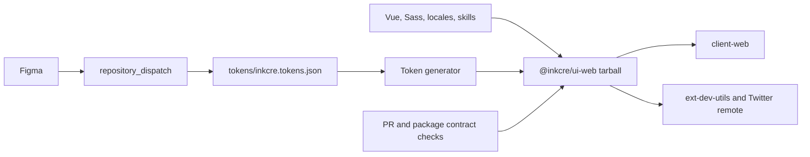

# UI Engineering And Design-to-UI Migration

- **Objective**: establish a reproducible, agent-friendly engineering and development contract for the InKCre UI library, then migrate the repository and published package identity from `design` to `ui` without carrying existing package-contract defects into the new identity. The working hypothesis is that stabilizing the package boundary before renaming it will make the cross-repository migration independently verifiable and reversible.
- **Guardrails**: preserve current product behavior, Vue component APIs (`Ink*`), CSS classes (`.ink-*`), and token contracts (`--ref-*`, `--sys-*`, `--comp-*`) unless a separate breaking-change decision is explicitly approved; retain accurate domain terms such as “Design System” and “design tokens” instead of mechanically replacing every `design` string; keep `tokens/inkcre.tokens.json` authoritative and generated Sass, UnoCSS, and Agent Skills derived; treat the published tarball rather than a source alias as the consumer contract; preserve the frozen-install contract in `../client-web`; keep repository, package, consumer, and remote-governance changes in bounded slices; do not implement, commit, publish, rename a remote repository, or mutate `../client-web` until Sir explicitly starts the relevant slice.
- **Verification**: prove one pinned runtime and one lockfile can reproduce installation; provide one green root check covering formatting, linting, type checking, tests, build, generator consistency, and package-contract smoke tests; verify the packed target web package through its JavaScript, types, CSS, Sass, token, locales, utilities, and UnoCSS entrypoints; run the complete `../client-web` check and affected extension builds against the published package; confirm generated artifacts are deterministic; confirm release and token-update workflows produce the required changeset and package through a deterministic workflow fixture; verify active code, configuration, and consumer documentation no longer depend on the old identity except for an explicitly approved historical or compatibility surface; verify GitHub Packages and remote URLs after the repository rename, with a live Figma dispatch retained as a post-deployment smoke rather than the only gate.
- **Current Truth**: Executions 01 and 02 are committed as `b1e0d6a` and `322dcf6`. Executions 03 through 05 are implemented and verified locally: the packed package contract is valid under both old and new identities, peers are externalized, public metadata is generated from one component manifest, token updates deterministically create a changeset, and Histoire covers all 21 public components across 108 variants while Vitest passes 104 behavior tests. The local identity is `@inkcre/ui` / `packages/web` / `@inkcre/ui-web@1.2.2`. That exact version is published privately to GitHub Packages, installs and imports from a disposable consumer, is linked to `InKCre/design`, and grants `InKCre/client-web` Actions the `Read` role. The old package remains installable and undeclared as deprecated under the freeze/deprecate/no-wrapper posture. No push, consumer edit, source overlay, remote rename, or old-package deprecation has occurred.
- **Next Step**: review [`execution-05.md`](execution-05.md) and preserve Executions 03–05 as a bounded commit when Sir explicitly requests one. Execution 06 requires a separate explicit start and must migrate all three known consumer importers to exact `@inkcre/ui-web@1.2.2` through the registry before any optional source overlay exists.

## Classification And Active Posture

- Constraint: engineering, package, registry, workspace, CI, and cross-repository development boundaries must change while product behavior remains stable.
- Reality: the producer package, registry artifact, source association, and known-consumer Actions read boundary are green; the remaining migration risk belongs to the consumer graph.
- Artifact: this packet, the phased migration plan, package-contract fixture, story-coverage gate, migration guide, and execution evidence.
- Active posture: Solidify. Execution 05 is complete; Execution 06 has not been authorized.

## Evidence Snapshot

- `package.json` now carries the private `@inkcre/ui` workspace identity and exposes the pinned toolchain and canonical root development/check commands.
- `packages/web/package.json` names `@inkcre/ui-web@1.2.2`, publishes to GitHub Packages with restricted access, and exposes only built JavaScript, declarations, CSS, Sass, token, locale, utility, and UnoCSS surfaces.
- `scripts/lib/ui-package.ts` resolves the renamed package once; token, package-metadata, and Agent Skill generators derive their outputs from repository and manifest authority instead of caller cwd.
- `.github/workflows/ci.yml` runs the root frozen-install contract, generated-output gates, story coverage, tests, build, packed contract, and Histoire smoke with read-only contents permission. The token-update workflow validates input and creates a deterministic package changeset.
- `.npmrc` contains only the `@inkcre` registry route. Local credentials belong to trusted user configuration, and CI publication credentials exist only on the release step.
- The root does not claim publication metadata. `@inkcre/ui-web` owns its future `InKCre/ui` repository link, package directory, restricted access policy, and GitHub Packages registry; GitHub currently links the package to `InKCre/design` until Execution 08 renames the repository.
- The package manifest lists 21 public components; a mechanical gate proves exactly 21 stories, 21 story documents, and 108 variants across six user-facing categories.
- The revised suite passes 104 behavior-focused tests in 12 files. Ten public components without focused tests remain a visible behavior-test backlog.
- Declaration diagnostics fail the build; rolled declarations contain no `.pnpm`, relative `node_modules`, or private source-path leaks.
- Package metadata, tokens, and Agent Skills regenerate repeatably, and the root check reports stale generated files without requiring a clean Git worktree.
- `../client-web/apps/client-web/vitest.config.ts` bypasses the public exports map with direct filesystem aliases.
- `../client-web` has three dependency importers for the old package: the web app, extension development utilities, and the Twitter remote. The browser extension does not consume it.
- GitHub reports `InKCre/design` as public, `@inkcre/web-design@1.2.2` as private, Actions default workflow permissions as `write`, and no required status-check rule on `main`; the existing ruleset only blocks deletion and non-fast-forward updates.
- `@inkcre/ui-web@1.2.2` is the only published new-name version. GitHub reports private visibility, an `InKCre/design` source association, and explicit `Read` Actions access for `InKCre/client-web`; a disposable exact-version install and ESM import pass.
- Both repositories were clean at the opening audit on 2026-07-27.

## Approved Target Identity

| Surface | Current | Candidate |
|---|---|---|
| GitHub repository and local directory | `InKCre/design` | `InKCre/ui` |
| Private workspace | `inkcre-design` | `@inkcre/ui` |
| Package directory | `packages/web-design` | `packages/web` |
| Published package | `@inkcre/web-design` | `@inkcre/ui-web` |
| Vite library identifier | `InKCreWebDesign` | `InKCreUIWeb` |
| Vue, CSS, and token APIs | `Ink*`, `.ink-*`, `--ref/sys/comp-*` | unchanged |
| Domain vocabulary | Design System, design tokens | unchanged |

Sir approved this identity on 2026-07-27. The workspace, package directory, published package metadata, and library identifier were renamed in Execution 05; the GitHub repository and local checkout rename remain Execution 08.

## Working Topology

## Supporting Material

- Implementation and migration roadmap: [`roadmap.md`](roadmap.md)
- Implementation preflight and mental rehearsal: [`preflight.md`](preflight.md)
- Execution 01 implementation evidence: [`execution-01.md`](execution-01.md)
- Execution 02 implementation evidence: [`execution-02.md`](execution-02.md)
- Execution 03 implementation evidence: [`execution-03.md`](execution-03.md)
- Execution 04 implementation evidence: [`execution-04.md`](execution-04.md)
- Execution 05 implementation evidence: [`execution-05.md`](execution-05.md)
- External engineering reference: [`partner-up-dev/ui`](https://github.com/partner-up-dev/ui)

## Open Decisions

There are no open decisions blocking Execution 05. The package remains private/restricted, and the old package is frozen for rollback, retained without a forwarding wrapper, and deprecated only after coordinated consumer migration.

SVC adoption is no longer on this task's critical path. The recommended disposition is a separate task after the UI migration contract is stable.

## Decision Log

- 2026-07-27: Sir opened a discussion to improve engineering and developer experience and to unify the project identity from `design` to `ui`.
- 2026-07-27: read-only audits of this repository and `../client-web` established the package, generator, CI, registry, and consumer blast radius.
- 2026-07-27: the recommended migration order became stabilize -> publish new identity -> migrate consumers -> rename remote.
- 2026-07-27: Sir explicitly required a task packet and directed the agent to current SVC and `../core-py` usage.
- 2026-07-27: this packet was created as the only authorized mutation; no implementation start has been granted.
- 2026-07-27: Sir challenged the generic web package name, requested a `partner-up-dev/ui` engineering audit, and asked for concrete registry-auth and local-source development designs.
- 2026-07-27: `partner-up-dev/ui` confirmed that web and UniApp packages can share the npm registry; `@inkcre/ui-web` became the recommended candidate while remaining unapproved.
- 2026-07-27: migration sequencing and implementation details moved to `roadmap.md` so this file remains the compact control surface.
- 2026-07-27: Sir approved the npm authority boundary but rejected a custom doctor/auth-probe layer; direct package-manager failures and concise setup documentation are sufficient until repeated evidence justifies more machinery.
- 2026-07-27: the source overlay was constrained to a process-scoped validated path with no tracked machine-specific value, and the real frozen-registry proof moved from producer pre-publish checks to the post-publication consumer migration gate.
- 2026-07-27: final preflight moved the optional source loop after the registry-backed consumer migration so aliases cannot mask publication defects.
- 2026-07-27: isolated QA established the existing 11-test failure baseline, non-fatal declaration errors, deterministic token output, and stale committed Agent Skills.
- 2026-07-27: GitHub preflight established that the current package is private, the candidate repository/package are not currently visible, workflow defaults are overly broad, and the external Figma dispatch sender is not observable from either repository.
- 2026-07-27: token update verification was tightened to require deterministic changeset generation in CI; live dispatch remains a supplementary integration smoke. Broad doctor and compatibility-check abstractions remain rejected on ROI grounds.
- 2026-07-27: Sir explicitly started Execution 01, allowed removal of broken tests during the planned cleanup, and accepted the recommended target identity ending in `@inkcre/ui-web`.
- 2026-07-27: Execution 01 established the pinned toolchain, single lockfile, root check, deterministic generator check, hard declaration diagnostics, behavior-oriented test baseline, frozen PR CI, and refreshed developer documentation.
- 2026-07-27: Sir corrected the pnpm target to the sole linked Homebrew installation, `11.17.0`; the old repository pin was confirmed to be what made pnpm report `10.25.0` inside the project. All workflow and manifest pins were aligned, and pnpm 11's dependency build-script allowlist was made explicit.
- 2026-07-27: the local and disposable-copy root checks passed; remote PR evidence remains pending.
- 2026-07-27: Sir authorized a bounded Execution 01 commit and explicitly started Execution 02.
- 2026-07-27: Execution 01 was committed as `b1e0d6a`.
- 2026-07-27: Execution 02 removed the project-owned credential placeholder, moved publish metadata to the leaf package, scoped CI registry configuration, narrowed release authority, and passed native missing/trusted-auth probes plus the complete root check.
- 2026-07-27: Sir removed the unused Copilot setup workflow and selected pnpm's locked runtime instead of `.node-version` as Node authority.
- 2026-07-27: a disposable `../client-web` copy passed frozen installation from GitHub Packages with trusted temporary auth and lifecycle scripts disabled; all three current UI consumers resolved `@inkcre/web-design@1.2.2`.
- 2026-07-27: Sir authorized the bounded Execution 02 commit after the consumer auth proof and pnpm runtime adjustment.
- 2026-07-27: Execution 02 was committed as `322dcf6`.
- 2026-07-27: Sir authorized implementation through completion of Execution 05.
- 2026-07-27: Execution 03 replaced the invalid package boundary with explicit built exports, one component manifest, deterministic generators, changeset enforcement, and a complete packed consumer contract; both old-name and new-name `1.2.2` tarballs pass.
- 2026-07-27: Execution 04 separated the Histoire catalog from runtime source, established category, preset, theme, and coverage contracts for all 21 public components and 108 variants, and retained behavior tests as a distinct proof layer.
- 2026-07-27: Execution 05 locally renamed the workspace, package path, package, build identity, generated surfaces, and documentation; selected restricted/private publication and the freeze/deprecate/no-wrapper compatibility policy.
- 2026-07-27: final review closed the manually dispatched CI base case, orphan story-document detection, reproducible old-name identity probe, historical preflight labeling, and the newly explicit text-document peer migration note.
- 2026-07-27: GitHub granted the existing CLI credential the additional `write:packages` scope after account-level confirmation; no token was written to repository configuration.
- 2026-07-27: `@inkcre/ui-web@1.2.2` was published privately, installed and imported from a disposable registry consumer, linked to `InKCre/design`, and granted `InKCre/client-web` Actions `Read` access. Execution 05 is complete.
