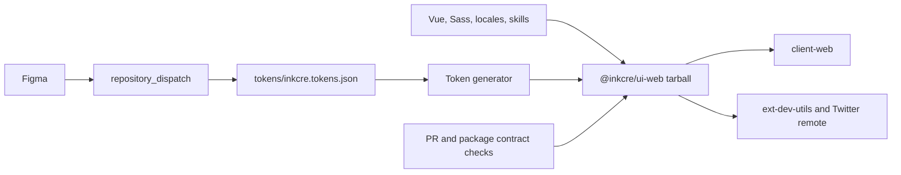

# UI Engineering And Design-to-UI Migration

- **Objective**: establish a reproducible, agent-friendly engineering and development contract for the InKCre UI library, then migrate the repository and published package identity from `design` to `ui` without carrying existing package-contract defects into the new identity. The working hypothesis is that stabilizing the package boundary before renaming it will make the cross-repository migration independently verifiable and reversible.
- **Guardrails**: preserve current product behavior, Vue component APIs (`Ink*`), CSS classes (`.ink-*`), and token contracts (`--ref-*`, `--sys-*`, `--comp-*`) unless a separate breaking-change decision is explicitly approved; retain accurate domain terms such as “Design System” and “design tokens” instead of mechanically replacing every `design` string; keep `tokens/inkcre.tokens.json` authoritative and generated Sass, UnoCSS, and Agent Skills derived; treat the published tarball rather than a source alias as the consumer contract; preserve the frozen-install contract in `../client-web`; keep repository, package, consumer, and remote-governance changes in bounded slices; do not implement, commit, publish, rename a remote repository, or mutate `../client-web` until Sir explicitly starts the relevant slice.
- **Verification**: prove one pinned runtime and one lockfile can reproduce installation; provide one green root check covering formatting, linting, type checking, tests, build, generator consistency, and package-contract smoke tests; verify the packed target web package through its JavaScript, types, CSS, Sass, token, locales, utilities, and UnoCSS entrypoints; run the complete `../client-web` check and affected extension builds against the published package; confirm generated artifacts are deterministic; confirm release and token-update workflows produce the required changeset and package through a deterministic workflow fixture; verify active code, configuration, and consumer documentation no longer depend on the old identity except for an explicitly approved historical or compatibility surface; verify GitHub Packages and remote URLs after the repository rename, with a live Figma dispatch retained as a post-deployment smoke rather than the only gate.
- **Current Truth**: Execution 01 is committed as `b1e0d6a`. Execution 02 is implemented and locally verified: pnpm `11.17.0` owns the locked Node `22.22.3` runtime; the repository owns only the `@inkcre` registry route; trusted user or step-scoped CI configuration owns credentials; the publishable package owns its repository and registry metadata; and the release job has explicit permissions with no shell-auth mutation. Missing auth produces a direct package-manager failure. A disposable trusted user config resolved the current private `@inkcre/web-design@1.2.2`, and a disposable `../client-web` copy passed frozen registry installation with lifecycle scripts disabled while the token was present; neither proof persisted or printed the token. Frozen installation and the complete root check pass without the former project-auth warning. Sir accepted the canonical identity `InKCre/ui` / `@inkcre/ui` / `packages/web` / `@inkcre/ui-web`. The existing package boundary remains invalid until Execution 03: the mixed `exports` map still makes Node reject the packed artifact, and utilities/locales declarations remain incomplete. The current package is private and linked to `InKCre/design`; future package visibility and the old-package compatibility posture remain unconfirmed. Active posture is Solidify after the completed local Execution 02 slice. Sir authorized its bounded commit. No push, remote CI run, governance mutation, publish, consumer edit, or remote rename has been authorized.
- **Next Step**: after preserving Execution 02 as a bounded commit, review [`execution-02.md`](execution-02.md). Execution 03 still requires an explicit start. Before Execution 05, confirm whether `@inkcre/ui-web` remains private and whether to accept the recommended freeze/deprecate/no-wrapper policy for `@inkcre/web-design`.

## Classification And Active Posture

- Constraint: engineering, package, registry, workspace, CI, and cross-repository development boundaries must change while product behavior remains stable.
- Reality: the current package boundary is invalid under Node package-resolution rules and downstream tests compensate for it.
- Artifact: this packet, the phased migration plan, package-contract tests, and later execution evidence.
- Active posture: Solidify. Execution 02 is locally complete; Execution 03 has not been authorized.

## Evidence Snapshot

- `package.json` still carries the old private-workspace identity, but now exposes the pinned toolchain and canonical root development/check commands.
- `packages/web-design/package.json` names the only public package, defines the invalid mixed `exports` map, and exposes build, Histoire, and Vitest leaf commands.
- `scripts/build-tokens.ts` and `scripts/build-agent-skills.ts` embed `packages/web-design` and the old package identity.
- `.github/workflows/ci.yml` now runs the root frozen-install contract with read-only contents permission; remote execution remains pending a pushed branch. The token-update workflow still does not create a changeset.
- `.npmrc` contains only the `@inkcre` registry route. Local credentials belong to trusted user configuration, and CI publication credentials exist only on the release step.
- The root no longer claims package publication metadata. `@inkcre/web-design` owns its GitHub repository link and `publishConfig.registry`.
- The package contains 21 exported components and 21 Histoire stories, but only 11 component test files.
- The revised suite passes 103 behavior-focused tests. `InkDialog` no longer tests private VM fields, and `InkImage` plus `InkScrim` cover uncontrolled/controlled expansion and close paths.
- Declaration diagnostics now fail the build; the pnpm/Vue shared-type inference is resolved without leaking `.pnpm` or relative `node_modules` paths into rolled declarations.
- Token and Agent Skill regeneration is repeatable, and the root check reports stale generated files without requiring a clean Git worktree.
- `../client-web/apps/client-web/vitest.config.ts` bypasses the public exports map with direct filesystem aliases.
- `../client-web` has three dependency importers for the old package: the web app, extension development utilities, and the Twitter remote. The browser extension does not consume it.
- GitHub reports `InKCre/design` as public, `@inkcre/web-design` as private, Actions default workflow permissions as `write`, and no required status-check rule on `main`; the existing ruleset only blocks deletion and non-fast-forward updates.
- Neither `InKCre/ui` nor `@inkcre/ui-web` is currently visible through the available GitHub APIs, but 404/search absence cannot prove that a renamed or reserved identifier is creatable.
- Both repositories were clean at the opening audit on 2026-07-27.

## Approved Target Identity

| Surface | Current | Candidate |
|---|---|---|
| GitHub repository and local directory | `InKCre/design` | `InKCre/ui` |
| Private workspace | `inkcre-design` | `@inkcre/ui` |
| Package directory | `packages/web-design` | `packages/web` |
| Published package | `@inkcre/web-design` | `@inkcre/ui-web` |
| Vite library identifier | `InKCreWebDesign` | `InKCreUIWeb` |
| Vue, CSS, and token APIs | `Ink*`, `.ink-*`, `--ref/sys/comp-*` | unchanged |
| Domain vocabulary | Design System, design tokens | unchanged |

Sir approved this identity on 2026-07-27. Durable renaming remains scheduled for Execution 05 and Execution 08.

## Working Topology

## Supporting Material

- Implementation and migration roadmap: [`roadmap.md`](roadmap.md)
- Implementation preflight and mental rehearsal: [`preflight.md`](preflight.md)
- Execution 01 implementation evidence: [`execution-01.md`](execution-01.md)
- Execution 02 implementation evidence: [`execution-02.md`](execution-02.md)
- External engineering reference: [`partner-up-dev/ui`](https://github.com/partner-up-dev/ui)

## Open Decisions

1. Keep the new package private like the current GitHub Package, or intentionally make it public and verify the resulting GitHub Packages policy.
2. Freeze the final `@inkcre/web-design` artifact, retain it for rollback, publish a migration guide, and deprecate it after coordinated migration without maintaining a forwarding wrapper; or explicitly request a compatibility package.

SVC adoption is no longer on this task's critical path. The recommended disposition is a separate task after the UI migration contract is stable.

## Decision Log

- 2026-07-27: Sir opened a discussion to improve engineering and developer experience and to unify the project identity from `design` to `ui`.
- 2026-07-27: read-only audits of this repository and `../client-web` established the package, generator, CI, registry, and consumer blast radius.
- 2026-07-27: the recommended migration order became stabilize -> publish new identity -> migrate consumers -> rename remote.
- 2026-07-27: Sir explicitly required a task packet and directed the agent to current SVC and `../core-py` usage.
- 2026-07-27: this packet was created as the only authorized mutation; no implementation start has been granted.
- 2026-07-27: Sir challenged the generic web package name, requested a `partner-up-dev/ui` engineering audit, and asked for concrete registry-auth and local-source development designs.
- 2026-07-27: `partner-up-dev/ui` confirmed that web and UniApp packages can share the npm registry; `@inkcre/ui-web` became the recommended candidate while remaining unapproved.
- 2026-07-27: migration sequencing and implementation details moved to `roadmap.md` so this file remains the compact control surface.
- 2026-07-27: Sir approved the npm authority boundary but rejected a custom doctor/auth-probe layer; direct package-manager failures and concise setup documentation are sufficient until repeated evidence justifies more machinery.
- 2026-07-27: the source overlay was constrained to a process-scoped validated path with no tracked machine-specific value, and the real frozen-registry proof moved from producer pre-publish checks to the post-publication consumer migration gate.
- 2026-07-27: final preflight moved the optional source loop after the registry-backed consumer migration so aliases cannot mask publication defects.
- 2026-07-27: isolated QA established the existing 11-test failure baseline, non-fatal declaration errors, deterministic token output, and stale committed Agent Skills.
- 2026-07-27: GitHub preflight established that the current package is private, the candidate repository/package are not currently visible, workflow defaults are overly broad, and the external Figma dispatch sender is not observable from either repository.
- 2026-07-27: token update verification was tightened to require deterministic changeset generation in CI; live dispatch remains a supplementary integration smoke. Broad doctor and compatibility-check abstractions remain rejected on ROI grounds.
- 2026-07-27: Sir explicitly started Execution 01, allowed removal of broken tests during the planned cleanup, and accepted the recommended target identity ending in `@inkcre/ui-web`.
- 2026-07-27: Execution 01 established the pinned toolchain, single lockfile, root check, deterministic generator check, hard declaration diagnostics, behavior-oriented test baseline, frozen PR CI, and refreshed developer documentation.
- 2026-07-27: Sir corrected the pnpm target to the sole linked Homebrew installation, `11.17.0`; the old repository pin was confirmed to be what made pnpm report `10.25.0` inside the project. All workflow and manifest pins were aligned, and pnpm 11's dependency build-script allowlist was made explicit.
- 2026-07-27: the local and disposable-copy root checks passed; remote PR evidence remains pending.
- 2026-07-27: Sir authorized a bounded Execution 01 commit and explicitly started Execution 02.
- 2026-07-27: Execution 01 was committed as `b1e0d6a`.
- 2026-07-27: Execution 02 removed the project-owned credential placeholder, moved publish metadata to the leaf package, scoped CI registry configuration, narrowed release authority, and passed native missing/trusted-auth probes plus the complete root check.
- 2026-07-27: Sir removed the unused Copilot setup workflow and selected pnpm's locked runtime instead of `.node-version` as Node authority.
- 2026-07-27: a disposable `../client-web` copy passed frozen installation from GitHub Packages with trusted temporary auth and lifecycle scripts disabled; all three current UI consumers resolved `@inkcre/web-design@1.2.2`.
- 2026-07-27: Sir authorized the bounded Execution 02 commit after the consumer auth proof and pnpm runtime adjustment.
