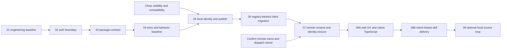
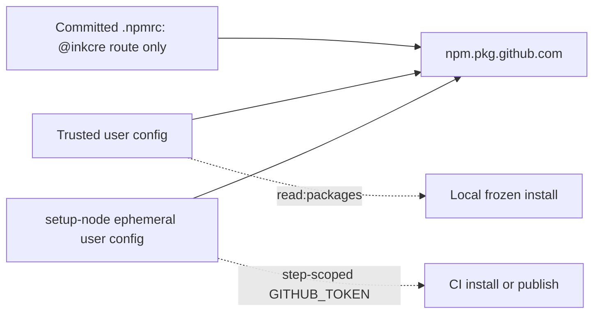
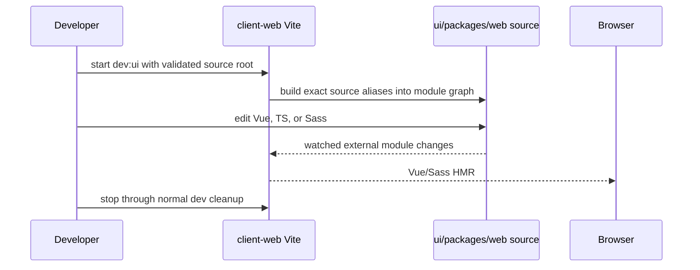

# UI Engineering And Migration Roadmap

This file owns the task-local implementation sequence, phase dependencies, exit proofs, and rollback boundaries. The compact current state and human steering point remain in [`packet.md`](packet.md).

## Target Outcome

```text
Repository:        InKCre/ui
Private workspace: @inkcre/ui
Web package path:  packages/web
Published package: @inkcre/ui-web
Consumer:          ../client-web
```

Sir approved these target names on 2026-07-27. The family is entity-first (`ui-web`) because the repository owns UI as the product surface and web is one renderer. A registry-specific generic `@inkcre/ui` would imply that npm can contain only one UI renderer; `partner-up-dev/ui` demonstrates that web and UniApp renderers can occupy the same registry.

## Delivery Dependency Graph



Each node must be independently releasable or reversible. A later node may not compensate for a failed earlier gate.

## PartnerUp Reference Audit

Reference: [`partner-up-dev/ui`](https://github.com/partner-up-dev/ui), default branch `main`, audited at commit `25e2f72570580b97f75d8a241b9149c0b4f4699c`.

### Adopt or adapt

- Root private package `@partner-up-dev/ui`, platform directories `packages/web` and `packages/uniapp`, and published packages `@partner-up-dev/ui-web` and `@partner-up-dev/ui-uniapp`.
- One root pnpm lockfile, explicit Node/pnpm pins, and frozen CI installation.
- Package-local `verify` composition and explicit `files`/`exports` allowlists.
- Generated component registry, version, global component types, and `--check` stale-generation gates.
- Package-local `skills/ui-web`, reviewed semantic seed data, a custom
  deterministic generator, and pinned TanStack Intent validation.
- `npm pack` -> extracted fixture -> consumer `vue-tsc` probe for the actual published type surface.
- Histoire story taxonomy, responsive/background presets, theme bridge, and mechanical story coverage.
- Changesets release PR, package-local `MIGRATION.md`, and repository metadata with package directory.

### Do not copy without correction

- The repository has only a publish workflow; no independent pull-request quality workflow exists, and release runs package builds rather than the full web `verify` gate.
- Its committed `.npmrc` still contains `${NODE_AUTH_TOKEN}` in repository-controlled auth configuration, which current pnpm treats as untrusted.
- `shamefully-hoist=true` and `strict-peer-dependencies=false` can hide dependency-boundary defects.
- Histoire coverage proves catalog presence, not behavior, accessibility, interaction, or screenshot stability; the reference has no Vitest, Playwright, or visual-regression suite.
- Mutable action tags and beta Histoire versions require an explicit InKCre policy rather than blind copying.
- Source-oriented UniApp exports are platform-specific and are not a model for the compiled web artifact.
- PartnerUp's custom generator, rather than Intent itself, owns its component
  extraction and intent/composition content. Its older Intent integration is a
  reference architecture, not a dependency version or workflow to copy
  verbatim.

## Execution 01 — Reproducible Engineering Baseline

**Status:** implemented and locally verified on 2026-07-27. Remote PR execution is pending a later commit/push authorization. See [`execution-01.md`](execution-01.md).

### State diff

```text
Two lockfiles, incomplete runtime contract, and leaf-only commands
->
One pinned toolchain, one lockfile, and one canonical root developer contract
```

### Planned work

1. Choose and pin one Node and pnpm pair from the package's actual compatibility evidence. Cross-repository pnpm-major alignment is not required because the repositories do not share a workspace or lockfile.
2. Remove the package-local lockfile and regenerate the root lock through the pinned package manager.
3. Establish root `dev`, `build`, `type-check`, `test`, `story`, and `check` entrypoints whose local and CI implementations are identical. Make declaration/type errors fail instead of surviving as build warnings.
4. Inventory existing formatting and lint rules before making them gates. Add stable `format` and `lint` entrypoints without bundling a repository-wide mechanical rewrite into the first corrective change.
5. Fix the known failing test baseline, separating three stale `InkDialog` assertions from the eight failures that expose the `InkImage` optional-model defect.
6. Fix stale root/package documentation and broken development entrypoints.
7. Add a pull-request workflow using frozen installation and explicit read-only permissions.
8. After the check is green, separately reduce the repository's default workflow permission from `write` to `read` and add the canonical check as a required `main` rule. This is a GitHub governance mutation and requires an explicit execution handshake.

### Exit proof

- A clean checkout requires no package-directory install.
- Runtime, lock, and tooling failures are exposed directly by the canonical install and check commands without adding a parallel diagnostic layer.
- Type/declaration failures and unit-test failures produce non-zero exits.
- The canonical root `check` is green locally and in a pull request.

### Actual proof

- A disposable copy installed from the root with `pnpm install --frozen-lockfile` and passed the same `pnpm check` used by CI.
- The final suite passes 11 files / 103 tests; Histoire builds 21 stories / 108 variants.
- A second generator run changes no generated token or Agent Skill output.
- Rolled declarations contain no `.pnpm`, relative `node_modules`, or `@vue/shared` imports.
- `pnpm changeset status` identifies `@inkcre/web-design` for a patch bump.
- Pull-request workflow syntax and commands are present locally; a real GitHub run remains the final external proof after the changes are committed and pushed.

## Execution 02 — Registry Authentication Boundary

**Status:** implemented and locally verified on 2026-07-27. A disposable `../client-web` copy passed frozen installation of the current private package through trusted temporary auth. Remote PR and release execution, future-package visibility, new-package consumer Actions access, and Dependabot proof remain tied to their real pushed/published artifacts. See [`execution-02.md`](execution-02.md).

### Authority model



Repository configuration owns registry routing. A developer's trusted user configuration or a CI-created user configuration owns credentials. The repository never owns a token placeholder.

### Planned local boundary

1. Keep only `@inkcre:registry=https://npm.pkg.github.com/` in the committed root `.npmrc`.
2. Remove every project-level `_auth`, `_authToken`, password, token helper, and environment-expanded credential.
3. Store the developer read token in trusted user-level pnpm/npm configuration or inject it into the current process from a credential manager. Never write or print the value from repository tooling.
4. Document the one-time trusted user-auth setup and the native pnpm/GitHub 401/403 remediation path. Do not add a repository-owned credential probe or diagnostic abstraction unless repeated failures later prove that its maintenance cost has positive ROI.

### Planned CI boundary

1. Use `actions/setup-node` with the GitHub Packages registry and `@inkcre` scope so CI receives an ephemeral trusted user config.
2. Bind `NODE_AUTH_TOKEN` only to the exact install or publish step.
3. Consumer jobs use `contents: read` and `packages: read`.
4. Release jobs use explicit `contents: write`, `pull-requests: write`, and `packages: write`; remove shell `npm config set` calls and never change the global default registry.
5. Put `publishConfig.registry` and `repository` metadata on the publishable web package, not only on the private workspace root.
6. Link the GitHub Package to the UI repository and grant `client-web` read access. Prefer GitHub's repository package-access grant for Actions and Dependabot; use an encrypted Dependabot read-only PAT only if that automatic path is proven insufficient.
7. Do not expose a package-read token to arbitrary dependency lifecycle scripts without an explicit risk decision. If installation scripts are disabled while the token is present, run required trusted preparation scripts explicitly after the token leaves the environment.

### Forbidden states

- `${NODE_AUTH_TOKEN}` or any credential in the committed `.npmrc`.
- A shell command containing `${{ secrets.* }}` as an npm config value.
- A job-wide or workflow-wide package token.
- `registry=https://npm.pkg.github.com` as the default for unscoped dependencies.
- Auth config, response bodies, or token-derived details in install or CI logs.

### Exit proof

- Trusted user auth resolves the current private package, local frozen installation succeeds without a project credential, and missing or invalid auth remains a direct package-manager error documented in the setup guide.
- A consumer pull-request install that resolves a private `@inkcre` package succeeds with `packages: read`; producer-only jobs retain `contents: read` until they have such a dependency.
- Changesets publishes with the repository `GITHUB_TOKEN` and no long-lived publish PAT.
- Dependabot can resolve the package through an explicitly proven access path.
- Repository search finds no persisted package credential.
- Package visibility matches the approved policy; repository metadata no longer claims `access: public` while the actual package is private.

## Execution 03 — Package And Generator Contract

**Status:** implemented and locally verified on 2026-07-27. See [`execution-03.md`](execution-03.md).

### Planned work

1. Correct the invalid `exports` map, including the `./uno` subpath.
2. Make every claimed export exist in the packed artifact; remove or build `./utils`, locales, styles, Sass partials, tokens, and declarations coherently.
3. Externalize peer dependencies consistently and record intentional bundling.
4. Make token and Agent Skill generators independent of process cwd.
5. Generate the component registry, global types, version, and Agent Skills from one public component authority; add stale-output checks.
6. Add a packed consumer fixture covering:
   - Node import and resolution;
   - Vue/TypeScript declarations and global components;
   - CSS presence and side effects;
   - Sass styles, functions, mixins, and tokens;
   - locales, utilities, and UnoCSS;
   - rejection of unintended raw component subpaths.
7. Require a changeset for package behavior, contents, public documentation, or generated token changes.
8. Make the token-update workflow create a collision-resistant changeset for the package being released, derived from validated dispatch input and workflow identity. A deterministic workflow fixture must prove payload -> token source -> generated artifacts -> changeset without requiring a live Figma request.

### Exit proof

- The packed old-name artifact passes the complete consumer fixture without direct `node_modules` aliases.
- Generators produce a clean Git diff on a second run.
- Token-update pull requests cannot be created without a valid package changeset; the deterministic fixture is the primary gate and a live dispatch is only an integration smoke.
- `../client-web` can remove its invalid-exports workaround after consuming the fixed artifact.

## Execution 04 — Story And Component Verification Baseline

**Status:** implemented and locally verified on 2026-07-27. See [`execution-04.md`](execution-04.md).

### Planned work

1. Keep Histoire as the primary interactive component catalog.
2. Separate stories from runtime component directories and organize them by user-facing category.
3. Generate or validate a public-component-to-story coverage map; require complete coverage or an explicit reviewed backlog.
4. Add responsive, background, and light/dark theme presets and a runtime theme smoke check.
5. Retain focused Vitest behavior tests for component contracts; prioritize the ten currently untested public components.
6. Add automated Histoire build smoke in PR CI.
7. Evaluate Playwright component/story smoke and screenshot regression only after deterministic fonts, animations, viewports, and browser ownership are defined.

### Exit proof

- Every public component has a discoverable story or an explicit exception.
- Theme and responsive catalog states build reproducibly.
- Behavioral tests and story catalog checks have distinct, documented responsibilities.

## Execution 05 — Local Identity Migration And New Package Publication

**Status:** completed and verified on 2026-07-27. `@inkcre/ui-web@1.2.2` is published privately, installable by exact version, linked to `InKCre/design`, and readable by `InKCre/client-web` Actions. See [`execution-05.md`](execution-05.md).

### Planned work

1. Rename the private root to `@inkcre/ui`.
2. Move `packages/web-design` to `packages/web`.
3. Rename the web package to the approved target, currently recommended as `@inkcre/ui-web`.
4. Update build, generator, Histoire, documentation, migration guide, changeset, package metadata, and generated identities in one local slice.
5. Preserve `Ink*`, `.ink-*`, token APIs, and valid design-system vocabulary.
6. Carry version lineage forward unless the registry/release proof supports a different explicit policy.
7. Publish and install the new package before touching consumer manifests.
8. Publish a migration guide and record the compatibility decision. The recommended low-complexity policy is to leave the final old-package version immutable and installable, migrate known consumers, then deprecate rather than unpublish it; do not build a forwarding wrapper without evidence of unknown active consumers.
9. Apply the approved package visibility, repository association, and `client-web` package-read grant before starting consumer mutation.

### Exit proof

- The repaired artifact can be reproducibly repacked and probed under both old and new identities; this identity proof is distinct from the immutable historical registry tarball.
- The new registry package is installable by exact version.
- The old exact version remains recoverable under the documented compatibility policy, and the migration guide names the bounded consumer commit that can be reverted.

## Execution 06 — Consumer Migration

**Status:** completed on 2026-07-28. The migration is committed and pushed in
`../client-web` as `b08cade`; complete client checks passed before and after the
producer repository rename. See
[`execution-06.md`](execution-06.md).

The already-published `@inkcre/ui-web@1.2.2` registry path becomes green before
the producer toolchain, skill delivery, or source loop changes.

### Planned work

1. Update all three consumer manifests to exact `@inkcre/ui-web@1.2.2`, plus
   the lockfile, runtime/type/style imports, Sass injection, Vite/Vitest
   configuration, tests, and active documentation.
2. Remove the old invalid-exports aliases rather than renaming them.
3. Run the web app, Twitter remote, extension utilities, and repository-wide client gates.
4. Record the pre-migration manifest and lock revision. Rollback is a bounded revert to that exact old-package state; dual dependencies or a forwarding package are not required.

### Exit proof

- A fresh `../client-web` CI job performs `pnpm install --frozen-lockfile` and the complete check against the new package. This is a consumer-migration gate, not a producer pre-publish or every-release gate: it proves the committed consumer lock resolves the actual registry artifact, access policy, integrity, peers, exports, and declarations without silently repairing the lock.
- All three manifests, the lockfile, and key Vite, Vitest, TypeScript, and Sass configuration are verified together.
- No active consumer reference to the old package remains outside an approved historical record or migration guide.

## Execution 07 — Remote Rename And Identity Closure

**Status:** remote rename applied and core identity proofs passed on
2026-07-28; integration and governance closure is in progress. See
[`execution-07.md`](execution-07.md).

The repository rename now immediately follows consumer migration. At that
point code, registry package, and all known consumers use the UI identity; the
remote is the last migration-owned identity boundary. Later engineering
enhancements should land as ordinary `InKCre/ui` work rather than prolonging
the transition from `design`.

### Planned work

1. Confirm `InKCre/ui` repository-name availability immediately before mutation; current 404/search absence is encouraging but does not prove that GitHub will accept the rename.
2. Rename the GitHub repository only after the Execution 06 registry-backed consumer gates pass.
3. Update local remotes, package repository metadata, Figma dispatch, webhooks, workflows, badges, docs, and clone instructions.
4. Verify release PR, package publication, GitHub Release, and a fresh clone through deterministic checks. Then run one live Figma dispatch as a supplementary post-rename smoke after the external sender/owner is identified.
5. Deprecate or freeze the old package according to the approved policy; do not unpublish recoverable artifacts by default.
6. Rename the local checkout directory only at a user/session boundary so an active development tool does not lose its workspace root.

### Exit proof

- Fresh clone -> frozen install -> root check -> package publish -> consumer install works through the UI identity.
- The deterministic token-workflow fixture remains green; a live Figma dispatch reaches the renamed repository and produces a changeset-bearing pull request as supplementary integration evidence.
- Rollback instructions and retained artifacts are tested and recorded.

## Execution 08A — Web DX And Native TypeScript

**Status:** implemented and locally verified on 2026-07-28; Ubuntu glibc CI is
the next external proof. See
[`execution-08a.md`](execution-08a.md).

This slice gives `packages/web` direct lint/format/fix ergonomics, closes its
clean-checkout source-development dependency gaps, and adopts the native
TypeScript 7 checker through an exact-pinned classic-API bridge after one-time
stock/compiler parity proof.

### Key boundaries

- The leaf package owns web editing commands and focused Oxc configuration;
  the root keeps CI orchestration.
- TypeScript resolution remains workspace-wide so `tsc`, `vue-tsc`, Volar,
  `tsx`, Vite declaration tooling, and subpath declaration emit do not load
  incompatible compiler hosts.
- Vue-aware Oxlint and Oxfmt are required; Oxlint's type-aware/type-check mode
  is not. `vue-tsc` remains authoritative for Vue virtual files.
- The bridge becomes canonical only after the complete root and packed-package
  contracts pass; no permanent TS5/TS7 dual lane is retained.

### Exit proof

- A disposable frozen installation can develop, type-check, test, format,
  lint, and build `packages/web` without stale workspace dependencies.
- Component source, Vue SFCs, stories, tests, and styles are covered by the
  package-local Oxc commands.
- The exact native bridge is active throughout type/declaration generation and
  passes macOS arm64 local plus Ubuntu glibc CI proof.
- The cutover is a bounded dependency/config/lockfile revert.

## Execution 08B — Intent-Based Agent Skill Delivery

**Status:** implemented and locally verified on 2026-07-28; release-PR refresh,
exact registry publication, and post-publication probe are the next gates. See
[`execution-08b.md`](execution-08b.md).

This slice replaces the non-discoverable `agent-skills/` documentation
categories with one installed-package `skills/ui-web` intent router, curated
composition knowledge, progressively disclosed generated references, and a
real TanStack Intent package contract.

### Key boundaries

- Intent owns path/schema validation, discovery, trust allowlisting, and
  installed-version loading.
- The InKCre generator owns component authority, Vue/TypeScript/story facts,
  reviewed intent/composition seed data, reference generation, and
  deterministic stale checks.
- `agent-skills/` is removed rather than mirrored because repository/consumer
  searches find no direct use of that path and the old path is not an Intent
  discovery contract.
- `intent stale` is informational until meaningful source/sync metadata is
  proven; an empty result is not accepted as freshness evidence.

### Exit proof

- Pinned Intent validates the package without packaging warnings.
- The packed artifact is discoverable and loadable as
  `@inkcre/ui-web#ui-web` from a disposable explicitly allowlisted consumer.
- Custom generation checks catch component, story/source, seed, and reference
  drift.
- A reviewed Changeset and exact registry publication upgrade the
  already-migrated consumer through the normal release path.

## Execution 09 — Opt-In Local UI Source Loop

This is a fast development lane, never the release contract.

### Ownership and invocation

- `../client-web` owns the source-consumption overlay because the host Vite/Vitest/TypeScript pipeline determines how external source is compiled.
- An explicit `INKCRE_UI_SOURCE_ROOT` or `--ui-source <absolute-path>` opt-in selects the sibling `ui/packages/web` source. The normal command has no overlay.
- No machine-specific path is stored in tracked configuration. A tracked helper reads the process-scoped opt-in, resolves its real path at startup, and validates the package name and expected entry files before returning configuration. With no opt-in, it returns no aliases or filesystem allowance, so other contributors retain the normal registry-backed development path.
- No `link:`, `file:`, workspace member, manifest, lockfile, or persistent `node_modules` mutation is allowed.

### Vite source graph

1. Map exact public specifiers, never a broad package-directory alias:
   - package root -> `src/index.ts`;
   - styles -> the source Sass entry;
   - functions, mixins, and ref/sys/comp tokens -> their exact partials;
   - utilities, locales, and UnoCSS -> their exact source entries.
2. Only in source mode, extend `server.fs.allow` with both `searchForWorkspaceRoot(process.cwd())` and the validated `packages/web` root. Vite disables automatic workspace-root detection when an explicit allowlist is supplied, so retaining the discovered root is required. The path comes from the current command, never a committed absolute path.
3. Set `resolve.dedupe` for Vue and shared peers so external UI source resolves the consumer's runtime instance.
4. Exclude the source package from dependency pre-bundling when needed.
5. Restrict client Sass `additionalData` to files actually inside the client application root; a substring such as `src/components/` must not inject client styles into sibling UI source.
6. Reuse the same source mapping in the Twitter remote when that remote is part of the active integration loop.

### Vitest and TypeScript source graph

- Vitest reuses the same exact aliases and Vue transform; it does not mix source aliases with the current direct-dist workaround.
- A generated temporary tsconfig overlay maps root, utilities, locales, and UnoCSS entries and includes the UI global-component declaration. It is ignored and removed with the session.
- The UI package's own type-check/watch remains authoritative for UI source. Registry declarations remain authoritative in the normal consumer lane.

### Lifecycle



Generated tokens require the UI token generator before Sass HMR; editing token JSON alone does not bypass generation.

### Release-fidelity lane

With the source overlay disabled:

1. Build the UI package.
2. Pack it into an explicit temporary directory.
3. Install/extract it only inside a disposable consumer fixture and run Node, TypeScript, Sass, CSS, locale, utility, and UnoCSS probes.
4. Stop at the disposable package consumer for producer-side pre-publish
   verification. Registry upgrade proof belongs to the normal post-08B release
   path, not this source overlay.

If the source lane passes while the packed lane fails, release is blocked. This prevents aliases from hiding missing files, invalid exports, or declaration leaks.

### Exit proof

- Editing an external UI Vue/Sass file updates the running client through HMR.
- Starting and stopping the source loop leaves both manifests and lockfiles byte-identical.
- Source-mode startup prints one clear non-release banner containing the resolved package root but no credential or unrelated machine state.
- The default check and CI never enable the overlay.

## Review And Rollback Gates

- Naming: repository, private workspace, directory, package, generated skill, dev route, and domain vocabulary are classified separately.
- Package: every export points to a packed file and every declaration resolves without repository source.
- Auth: routing and credential authority remain separate; logs contain no secrets.
- Story: catalog coverage does not substitute for behavior or visual assertions.
- Source loop: no local alias result is accepted as release proof.
- Native tooling: one workspace TypeScript host feeds every compiler consumer;
  Oxlint does not impersonate the Vue declaration checker.
- Agent guidance: installed tarball discovery/load and custom semantic
  generation are separate required proofs.
- Cross-repository: the proven `1.2.2` producer publication precedes consumer
  mutation; later DX and Skill releases do not redefine migration success.
- Compatibility: use a documented exact-version and commit rollback; do not add a verification framework whose only purpose is to restate static searches and frozen-install results.
- Remote: GitHub rename follows the registry-backed consumer migration
  immediately and is never relied on as the only rollback mechanism.
- Rollback: published versions remain immutable; recover by dependency rollback, forward fix, or explicit deprecation rather than destructive unpublish.
